---
## Front matter
title: "Отчет по лабораторной работе №2"
subtitle: "Архитектура компьютера"
author: "Дмитрий Константинович Кобзев"

## Generic otions
lang: ru-RU
toc-title: "Содержание"

## Bibliography
bibliography: bib/cite.bib
csl: pandoc/csl/gost-r-7-0-5-2008-numeric.csl

## Pdf output format
toc: true # Table of contents
toc-depth: 2
lof: true # List of figures
lot: true # List of tables
fontsize: 12pt
linestretch: 1.5
papersize: a4
documentclass: scrreprt
## I18n polyglossia
polyglossia-lang:
  name: russian
  options:
	- spelling=modern
	- babelshorthands=true
polyglossia-otherlangs:
  name: english
## I18n babel
babel-lang: russian
babel-otherlangs: english
## Fonts
mainfont: PT Serif
romanfont: PT Serif
sansfont: PT Sans
monofont: PT Mono
mainfontoptions: Ligatures=TeX
romanfontoptions: Ligatures=TeX
sansfontoptions: Ligatures=TeX,Scale=MatchLowercase
monofontoptions: Scale=MatchLowercase,Scale=0.9
## Biblatex
biblatex: true
biblio-style: "gost-numeric"
biblatexoptions:
  - parentracker=true
  - backend=biber
  - hyperref=auto
  - language=auto
  - autolang=other*
  - citestyle=gost-numeric
## Pandoc-crossref LaTeX customization
figureTitle: "Рис."
tableTitle: "Таблица"
listingTitle: "Листинг"
lofTitle: "Список иллюстраций"
lotTitle: "Список таблиц"
lolTitle: "Листинги"
## Misc options
indent: true
header-includes:
  - \usepackage{indentfirst}
  - \usepackage{float} # keep figures where there are in the text
  - \floatplacement{figure}{H} # keep figures where there are in the text
---

# Цель работы

Изучение идеологии и применение средств контроля версий. Приобретение практических навыков по работе с системой git.

# Задание

1. Создание отчет по выполнению лабораторной работы в соответствующем каталоге рабочего пространства (labs>lab02>report)

2. Скопируйте отчеты по выполнению предыдущих лабораторных работ в соответствующие каталоги созданного рабочего пространства.

3. Загрузите файлы на github.

# Выполнение лабораторной работы                                                |
[@gnu-doc:bash;@newham:2005:bash;@zarrelli:2017:bash;@robbins:2013:bash;@tannenbaum:arch-pc:ru;@tannenbaum:modern-os:ru]

Создаем учетную запись на сайте https://github.com/ и заполняем основные данные (рис. 1.1).
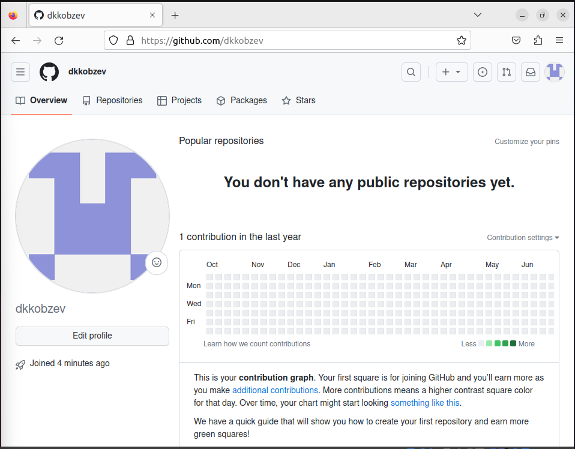{#fig:001 width=70%}

Делаем предварительную конфигурацию git. Открываем терминал и вводим
следующие команды, указав имя и email владельца репозитория (рис. 1.2) .
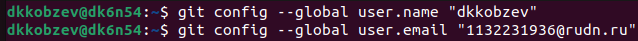{#fig:002 width=70%}

Настраиваем utf-8 в выводе сообщений git (рис. 1.3).
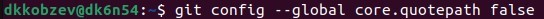{#fig:003 width=70%}

Задаем имя начальной ветки(master) (рис. 1.4).
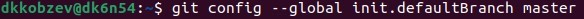{#fig:004 width=70%}

Задаем параметр autocrlf (рис. 1.5).
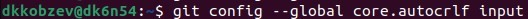{#fig:005 width=70%}

Задаем параметр safecrlf (рис. 1.6).
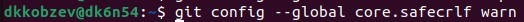{#fig:006 width=70%}

Генерируем пару ключей (приватный и открытый) (рис. 1.7).
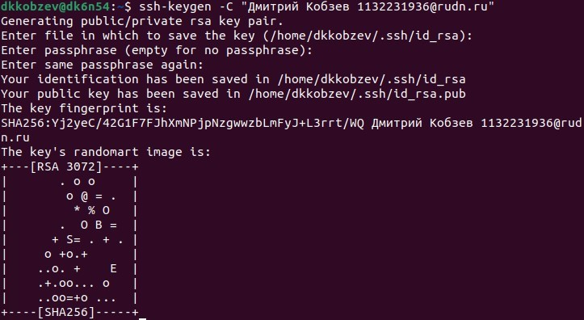{#fig:007 width=70%}

Копируем ключ из локальной сети в буфер обмена (рис. 1.8).
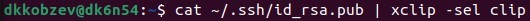{#fig:008 width=70%}

Загружаем сгенеренный открытый ключ (рис. 1.9).
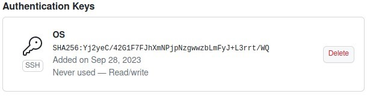{#fig:009 width=70%}

Открываем терминал и создаем каталог для предмета “Архитектура компьютера” (рис. 1.10).
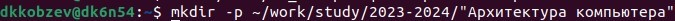{#fig:010 width=70%}

Создаем репозиторий на основе шаблона (рис. 1.11).
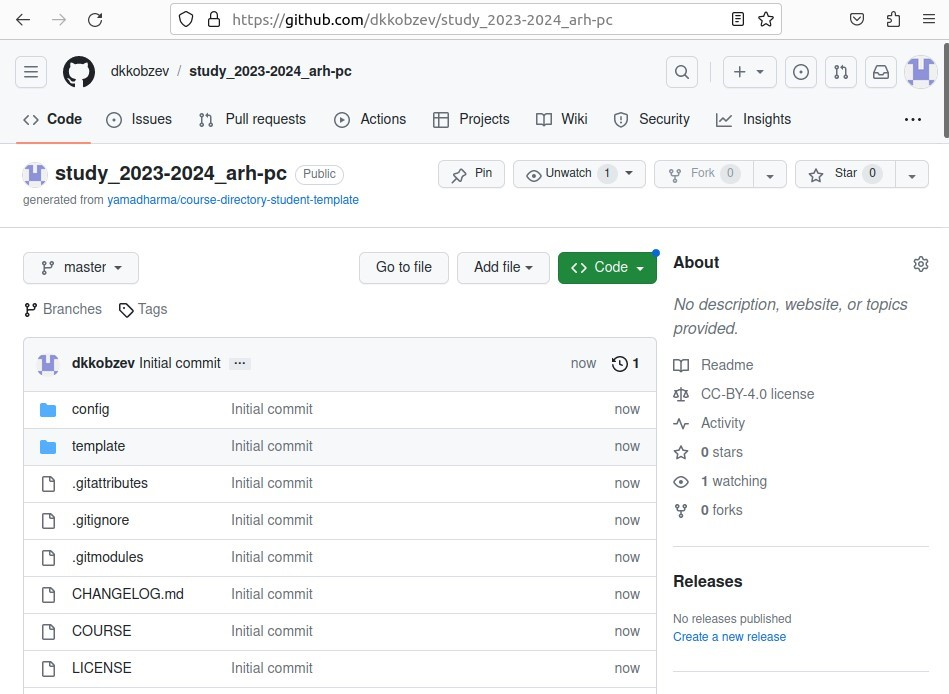{#fig:011 width=70%}

Открываем терминал и переходим в каталог курса (рис. 1.12).
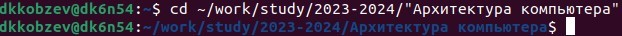{#fig:013 width=70%}

Клонируем созданный репозиторий (рис. 1.13).
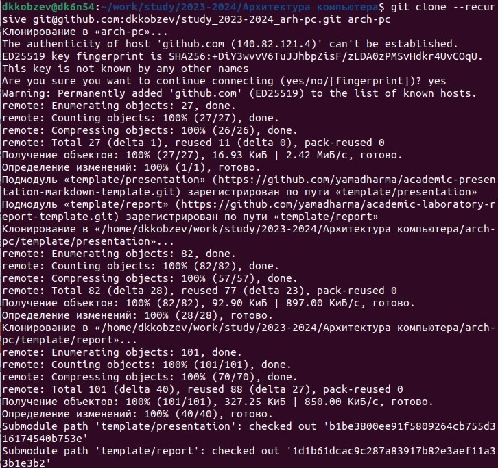{#fig:013 width=70%}

Переходим в каталог курса (рис. 1.14).
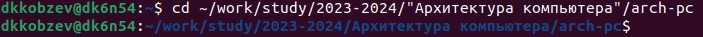{#fig:014 width=70%}

Удаляем лишние файлы (рис. 1.15).
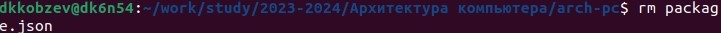{#fig:015 width=70%}

Создаем необходимые каталоги (рис. 1.16).
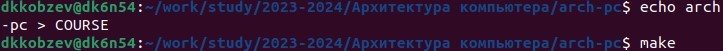{#fig:016 width=70%}

Отправляем файлы на сервер (рис. 1.17), (рис. 1.18), (рис. 1.19), (рис. 1.20), (рис. 1.21).
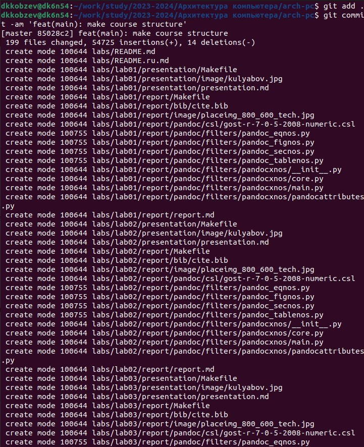{#fig:017 width=70%}
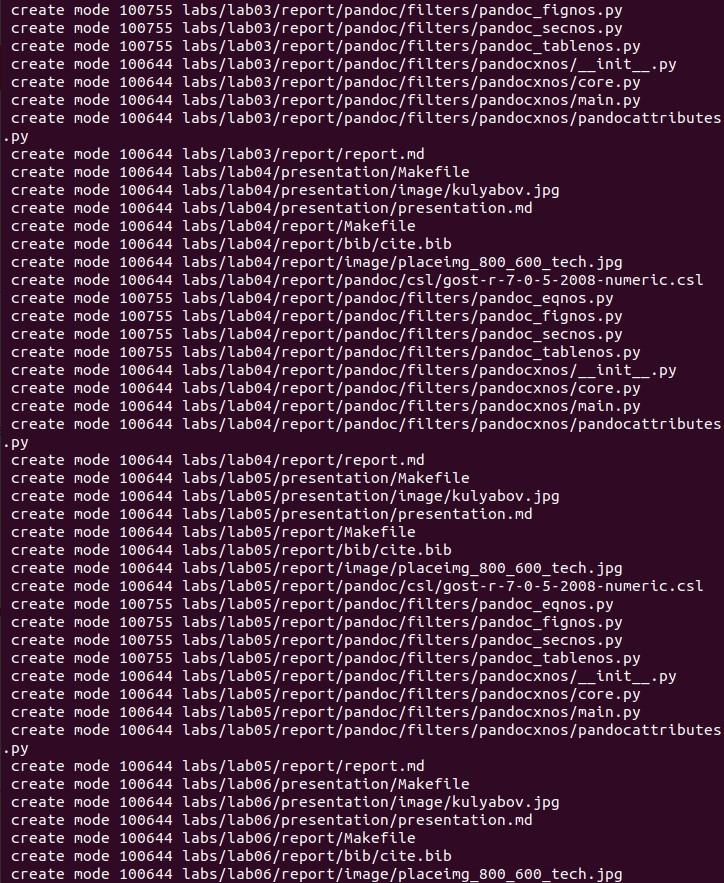{#fig:018 width=70%}
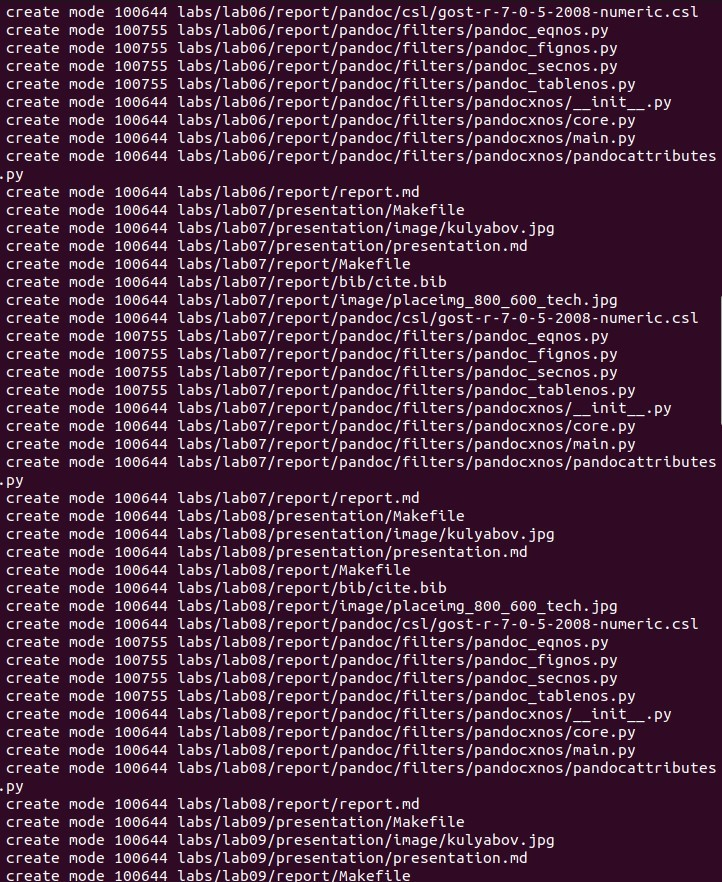{#fig:019 width=70%}
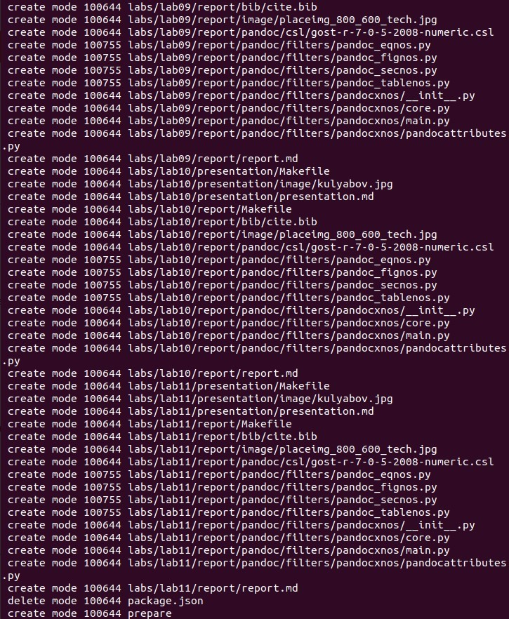{#fig:020 width=70%}
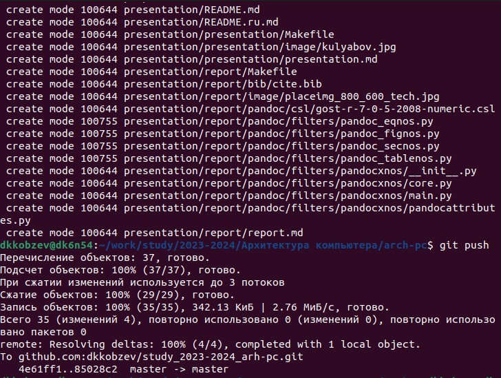{#fig:021 width=70%}

Проверяем правильность создания иерархии рабочего пространства в локальном
репозитории и на странице github (рис. 1.22), (рис. 1.23).
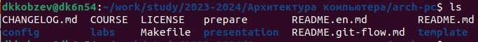{#fig:022 width=70%}
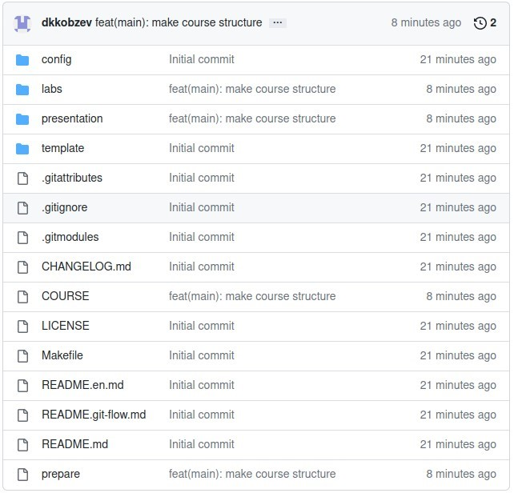{#fig:023 width=70%}

# Самостоятельная работа

Задание 1.

Создаем отчет по выполнению лабораторной работы в соответствующем каталоге
рабочего пространства (labs>lab02>report) (рис. 2.1).
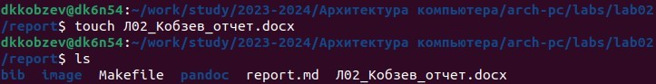{#fig:024 width=70%}

Задание 2.

Копируем отчеты по выполнению предыдущих лабораторных работ в соответствующие каталоги созданного рабочего пространства (рис. 2.2).
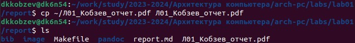{#fig:025 width=70%}

Задание 3.

Загружаем файлы на github (рис. 2.3).
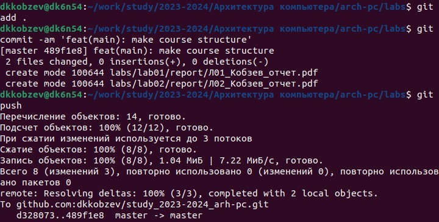{#fig:026 width=70%}

# Выводы

В ходе выполнения лабораторной работы мною были изучены идеология и применение средств контроля версий. Приобретены практические навыки по работе с системой git.

# Список литературы{.unnumbered}

::: {#refs}
:::
