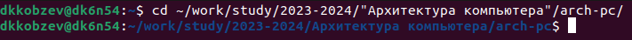
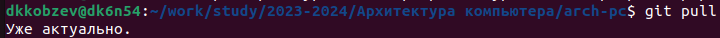
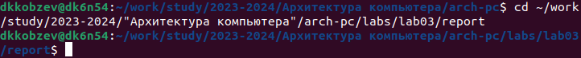
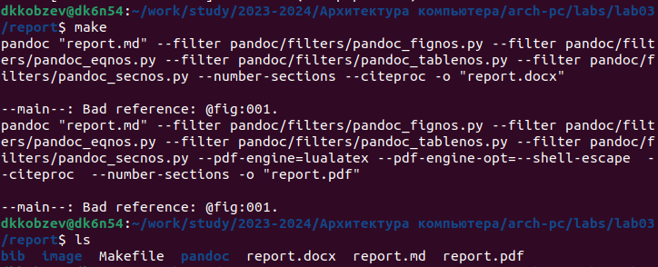
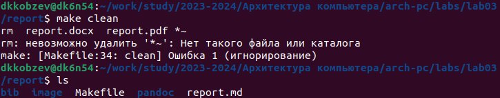
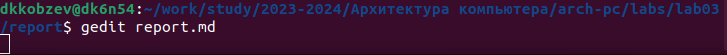
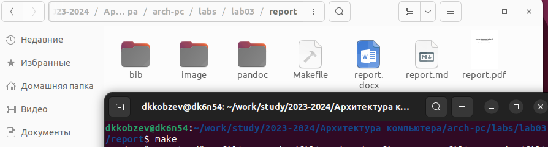
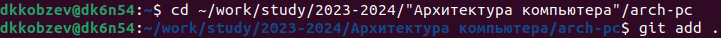
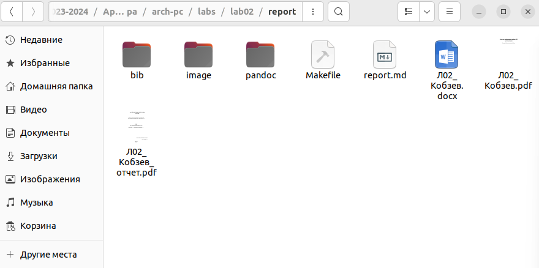
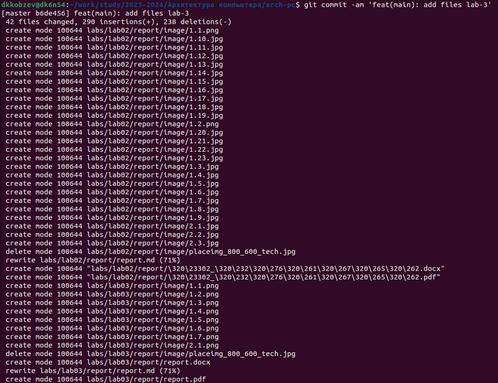

---
## Front matter
title: "Отчет по лабораторной работе №2"
subtitle: "Архитектура компьютера"
author: "Дмитрий Константинович Кобзев"

## Generic otions
lang: ru-RU
toc-title: "Содержание"

## Bibliography
bibliography: bib/cite.bib
csl: pandoc/csl/gost-r-7-0-5-2008-numeric.csl

## Pdf output format
toc: true # Table of contents
toc-depth: 2
lof: true # List of figures
lot: true # List of tables
fontsize: 12pt
linestretch: 1.5
papersize: a4
documentclass: scrreprt
## I18n polyglossia
polyglossia-lang:
  name: russian
  options:
	- spelling=modern
	- babelshorthands=true
polyglossia-otherlangs:
  name: english
## I18n babel
babel-lang: russian
babel-otherlangs: english
## Fonts
mainfont: PT Serif
romanfont: PT Serif
sansfont: PT Sans
monofont: PT Mono
mainfontoptions: Ligatures=TeX
romanfontoptions: Ligatures=TeX
sansfontoptions: Ligatures=TeX,Scale=MatchLowercase
monofontoptions: Scale=MatchLowercase,Scale=0.9
## Biblatex
biblatex: true
biblio-style: "gost-numeric"
biblatexoptions:
  - parentracker=true
  - backend=biber
  - hyperref=auto
  - language=auto
  - autolang=other*
  - citestyle=gost-numeric
## Pandoc-crossref LaTeX customization
figureTitle: "Рис."
tableTitle: "Таблица"
listingTitle: "Листинг"
lofTitle: "Список иллюстраций"
lotTitle: "Список таблиц"
lolTitle: "Листинги"
## Misc options
indent: true
header-includes:
  - \usepackage{indentfirst}
  - \usepackage{float} # keep figures where there are in the text
  - \floatplacement{figure}{H} # keep figures where there are in the text
---

# Цель работы
Освоение процедуры оформления отчетов с помощью легковесного языка разметки Markdown.

# Задание
1. Создание отчет по выполнению лабораторной работы в соответствующем каталоге рабочего пространства (labs>lab02>report)

2. Скопируйте отчеты по выполнению предыдущих лабораторных работ в соответствующие каталоги созданного рабочего пространства.

3. Загрузите файлы на github.

# Выполнение лабораторной работы                                             |
[@gnu-doc:bash;@newham:2005:bash;@zarrelli:2017:bash;@robbins:2013:bash;@tannenbaum:arch-pc:ru;@tannenbaum:modern-os:ru]

Открываем терминал и переходим в каталог курса сформированный при выполнении лабораторной работы №2 (рис. 1.1).
{#fig:001 width=70%}

Обновляем локальный репозиторий, скачав изменения из удаленного репозитория с помощью команды git pull (рис. 1.2).
{#fig:002 width=70%}

Переходим в каталог курса с шаблоном отчета по лабораторной работе №3 (рис. 1.3).
{#fig:003 width=70%}

Проводим компиляцию шаблона с использованием Makefile. Для этого вводим команду make. Проверяем корректность полученных файлов. (рис. 1.4).
{#fig:004 width=70%}

Удаляем полученные файлы с использованием Makefile. Для этого вводим команду make clean (рис. 1.5).
{#fig:005 width=70%}

Открываем файл report.md с помощью gedit (рис. 1.6).
{#fig:006 width=70%}

Заполняем отчет и компилируем отчет с использованием Makefile. Проверяем корректность полученных файлов (рис. 1.7).
{#fig:007 width=70%}

Загружаем файлы на Github (рис. 1.8).
{#fig:008 width=70%}

# Самостоятельная работа
Задание 1.
В соответствующем каталоге делаем отчет по лабораторной работе №2 в формате Markdown. (рис. 2.1).
{#fig:024 width=70%}

Задание 2.
Загружаем файлы на github (рис. 2.3).
{#fig:026 width=70%}

# Выводы
В ходе выполнения лабораторной работы мною были освоены процедуры оформления отчетов с помощью легковесного языка разметки Markdown.

# Список литературы{.unnumbered}
::: {#refs}
:::
