---
## Front matter
title: "Отчет по лабораторной работе №4"
subtitle: "Архитектура компьютера"
author: "Дмитрий Константинович Кобзев"

## Generic otions
lang: ru-RU
toc-title: "Содержание"

## Bibliography
bibliography: bib/cite.bib
csl: pandoc/csl/gost-r-7-0-5-2008-numeric.csl

## Pdf output format
toc: true # Table of contents
toc-depth: 2
lof: true # List of figures
lot: true # List of tables
fontsize: 12pt
linestretch: 1.5
papersize: a4
documentclass: scrreprt
## I18n polyglossia
polyglossia-lang:
  name: russian
  options:
	- spelling=modern
	- babelshorthands=true
polyglossia-otherlangs:
  name: english
## I18n babel
babel-lang: russian
babel-otherlangs: english
## Fonts
mainfont: PT Serif
romanfont: PT Serif
sansfont: PT Sans
monofont: PT Mono
mainfontoptions: Ligatures=TeX
romanfontoptions: Ligatures=TeX
sansfontoptions: Ligatures=TeX,Scale=MatchLowercase
monofontoptions: Scale=MatchLowercase,Scale=0.9
## Biblatex
biblatex: true
biblio-style: "gost-numeric"
biblatexoptions:
  - parentracker=true
  - backend=biber
  - hyperref=auto
  - language=auto
  - autolang=other*
  - citestyle=gost-numeric
## Pandoc-crossref LaTeX customization
figureTitle: "Рис."
tableTitle: "Таблица"
listingTitle: "Листинг"
lofTitle: "Список иллюстраций"
lotTitle: "Список таблиц"
lolTitle: "Листинги"
## Misc options
indent: true
header-includes:
  - \usepackage{indentfirst}
  - \usepackage{float} # keep figures where there are in the text
  - \floatplacement{figure}{H} # keep figures where there are in the text
---

# Цель работы
Освоение процедуры компиляции и сборки программ, написанных на ассемблере NASM.

# Задание
1. В каталоге ~/work/arch-pc/lab04 с помощью команды cp создайте копию файла
hello.asm с именем lab4.asm
2. С помощью любого текстового редактора внесите изменения в текст программы в
файле lab4.asm так, чтобы вместо Hello world! на экран выводилась строка с вашими
фамилией и именем.
3. Оттранслируйте полученный текст программы lab4.asm в объектный файл. Выполните
компоновку объектного файла и запустите получившийся исполняемый файл.
4. Скопируйте файлы hello.asm и lab4.asm в Ваш локальный репозиторий в ката-
лог ~/work/study/2023-2024/"Архитектура компьютера"/arch-pc/labs/lab04/.
Загрузите файлы на Github.

# Выполнение лабораторной работы                                             |
[@gnu-doc:bash;@newham:2005:bash;@zarrelli:2017:bash;@robbins:2013:bash;@tannenbaum:arch-pc:ru;@tannenbaum:modern-os:ru]

Создаем каталог для работы с программами на языке ассемблера NASM (рис. 1.1).
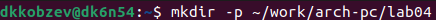{#fig:001 width=70%}

Переходим в созданный каталог (рис. 1.2).
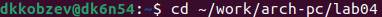{#fig:002 width=70%}

Создаем текстовый файл с именем hello.asm (рис. 1.3).
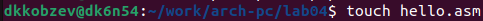{#fig:003 width=70%}

Открываем этот файл с помощью gedit (рис. 1.4).
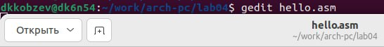{#fig:004 width=70%}

Вводим в него следующий текст (рис. 1.5).
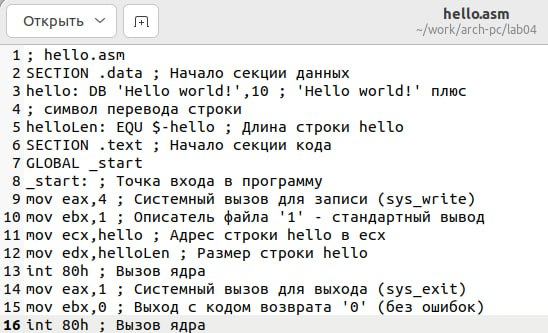{#fig:005 width=70%}

Компилируем приведенного выше текста программы "Hello World" (рис. 1.6).
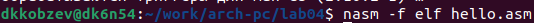{#fig:006 width=70%}

Проверяем, что объектный файл создан (рис. 1.7).
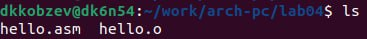{#fig:007 width=70%}

Компилируем исходный файл hello.asm в obj.o и создаем файл листинга list.lst (рис. 1.8).
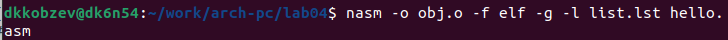{#fig:008 width=70%}

Проверяем правильность выполнения программы (рис. 1.9).
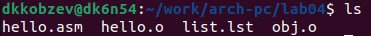{#fig:009 width=70%}

Передаем объектный файл на обработку компоновщику(рис. 1.10).
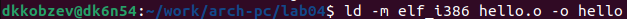{#fig:010 width=70%}

Проверяем правильность выполнения программы (рис. 1.11).
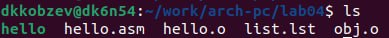{#fig:011 width=70%}

Выполняем следующую команду (рис. 1.12).
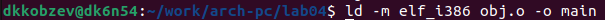{#fig:012 width=70%}

Запускаем на выполнение созданный исполняемый файл, находящийся в текущем каталоге (рис. 1.13).
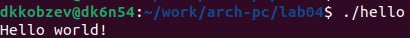{#fig:013 width=70%}

# Самостоятельная работа
Задание 1.
В каталоге ~/work/arch-pc/lab04 с помощью команды cp создаем копию файла
hello.asm с именем lab4.asm (рис. 2.1).
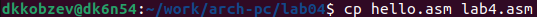{#fig:014 width=70%}

Задание 2.
С помощью любого текстового редактора вносим изменения в текст программы в
файле lab4.asm так, чтобы вместо Hello world! на экран выводилась строка с моими
фамилией и именем. (рис. 2.2).
{#fig:015 width=70%}

Задание 3.
Оттранслирем полученный текст программы lab4.asm в объектный файл. Выполним
компоновку объектного файла и запустим получившийся исполняемый файл.
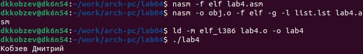{#fig:016 width=70%}

Задание 4.
Скопируем файлы hello.asm и lab4.asm в мой локальный репозиторий в ката-
лог ~/work/study/2023-2024/"Архитектура компьютера"/arch-pc/labs/lab04/.
Загрузим файлы на Github.
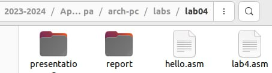{#fig:017 width=70%}
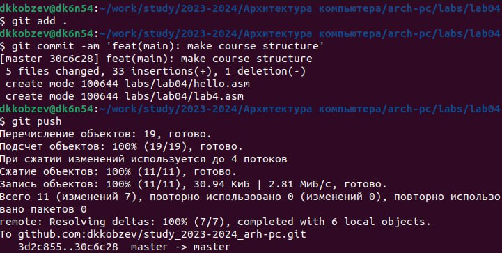{#fig:018 width=70%}

# Выводы
В ходе выполнения лабораторной работы мною были освоены процедуры компиляции и сборки программ, написанных на ассемблере NASM..

# Список литературы{.unnumbered}
::: {#refs}
:::
