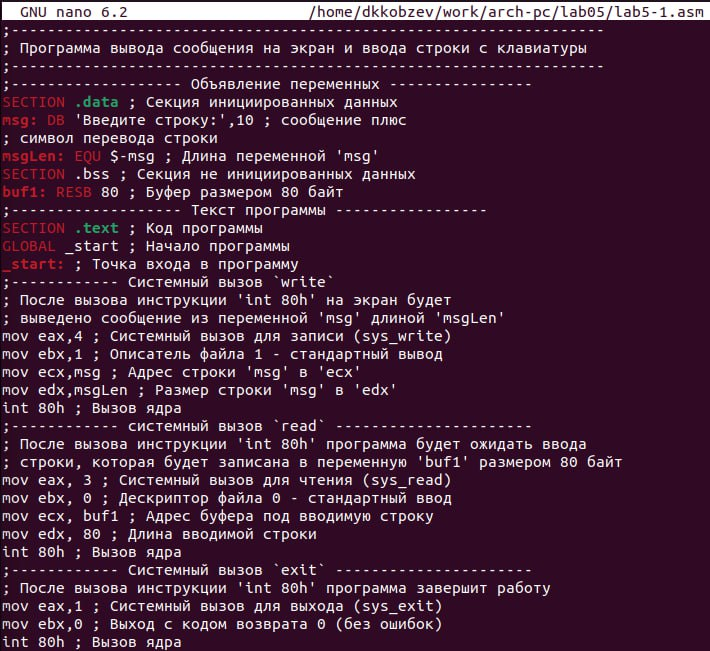

---
## Front matter
title: "Отчет по лабораторной работе №5"
subtitle: "Архитектура компьютера"
author: "Дмитрий Константинович Кобзев"

## Generic otions
lang: ru-RU
toc-title: "Содержание"

## Bibliography
bibliography: bib/cite.bib
csl: pandoc/csl/gost-r-7-0-5-2008-numeric.csl

## Pdf output format
toc: true # Table of contents
toc-depth: 2
lof: true # List of figures
lot: true # List of tables
fontsize: 12pt
linestretch: 1.5
papersize: a4
documentclass: scrreprt
## I18n polyglossia
polyglossia-lang:
  name: russian
  options:
	- spelling=modern
	- babelshorthands=true
polyglossia-otherlangs:
  name: english
## I18n babel
babel-lang: russian
babel-otherlangs: english
## Fonts
mainfont: PT Serif
romanfont: PT Serif
sansfont: PT Sans
monofont: PT Mono
mainfontoptions: Ligatures=TeX
romanfontoptions: Ligatures=TeX
sansfontoptions: Ligatures=TeX,Scale=MatchLowercase
monofontoptions: Scale=MatchLowercase,Scale=0.9
## Biblatex
biblatex: true
biblio-style: "gost-numeric"
biblatexoptions:
  - parentracker=true
  - backend=biber
  - hyperref=auto
  - language=auto
  - autolang=other*
  - citestyle=gost-numeric
## Pandoc-crossref LaTeX customization
figureTitle: "Рис."
tableTitle: "Таблица"
listingTitle: "Листинг"
lofTitle: "Список иллюстраций"
lotTitle: "Список таблиц"
lolTitle: "Листинги"
## Misc options
indent: true
header-includes:
  - \usepackage{indentfirst}
  - \usepackage{float} # keep figures where there are in the text
  - \floatplacement{figure}{H} # keep figures where there are in the text
---

# Цель работы
Приобретение практических навыков работы в Midnight Commander. Освоение инструкций
языка ассемблера mov и int.

# Задание
1. Создайте копию файла lab5-1.asm. Внесите изменения в программу (без использова-
ния внешнего файла in_out.asm), так чтобы она работала по следующему алгоритму:
• вывести приглашение типа “Введите строку:”;
• ввести строку с клавиатуры;
• вывести введённую строку на экран.
2. Получите исполняемый файл и проверьте его работу. На приглашение ввести строку
введите свою фамилию.
3. Создайте копию файла lab5-2.asm. Исправьте текст программы с использование под-
программ из внешнего файла in_out.asm, так чтобы она работала по следующему
алгоритму:
• вывести приглашение типа “Введите строку:”;
• ввести строку с клавиатуры;
• вывести введённую строку на экран.
4. Создайте исполняемый файл и проверьте его работу.

# Выполнение лабораторной работы                                             |
[@gnu-doc:bash;@newham:2005:bash;@zarrelli:2017:bash;@robbins:2013:bash;@tannenbaum:arch-pc:ru;@tannenbaum:modern-os:ru]

Открываем Midnight Commander.
{#fig:001 width=70%}

Переходим в каталог ~/work/arch-pc созданный при выполнении лабораторной работы №4  (рис. 1.2).
{#fig:002 width=70%}

Cоздаем папку lab05 и переходим в созданный каталог (рис. 1.3).
{#fig:003 width=70%}

Создаем файл lab5-1.asm (рис. 1.4).
{#fig:004 width=70%}

Открываем файл lab5-1.asm для редактирования во встроенном редактори и вводим текст программы листинга 5.1. (рис. 1.5).
{#fig:005 width=70%}

Открываем файл lab5-1.asm для просмотра и убеждаемся, что файл содержит текст программы (рис. 1.6).
{#fig:006 width=70%}

Транслируем текст программы lab5-1.asm в объектный файл. Выполняем компоновку объектного файла и запускаем получившийся исполняемый файл. Программа выводит строку 'Введите строку:' и ожидает ввода с клавиатуры. На запрос вводим ФИО(рис. 1.7).
{#fig:007 width=70%}

Качаем файл in_out.asm со страницы курса в ТУИС. (рис. 1.8).
{#fig:008 width=70%}

Копируем файл in_out.asm в каталог lab05 (рис. 1.9).
{#fig:009 width=70%}

Создаем копию файла lab5-1.asm с именем lab5-2.asm.  (рис. 1.10).
{#fig:010 width=70%}

Исправляем текст программы в файле lab5-2.asm с использованием подпрограмм из
внешнего файла in_out.asm.(рис. 1.11).
{#fig:011 width=70%}

В файле lab5-2.asm замените подпрограмму sprintLF на sprint. (рис. 1.11).
{#fig:012 width=70%}

# Самостоятельная работа
Задание 1.
Создаем копию файла lab5-1.asm. Вносим изменения в программу (без использова-
ния внешнего файла in_out.asm), так чтобы она работала по следующему алгоритму:
• вывести приглашение типа “Введите строку:”;
• ввести строку с клавиатуры;
• вывести введённую строку на экран. (рис. 2.1).
{#fig:013 width=70%}

Задание 2.
Получаем исполняемый файл и проверьте его работу. На приглашение ввести строку
вводим фамилию. (рис. 2.2).
{#fig:014 width=70%}

Задание 3.
Создаем копию файла lab5-2.asm. Вносим изменения в программу с использованием подпрограмм из внешнего файла in_out.asm, так чтобы она работала по следующему алгоритму:
• вывести приглашение типа “Введите строку:”;
• ввести строку с клавиатуры;
• вывести введённую строку на экран.
{#fig:015 width=70%}

Задание 4.
Получаем исполняемый файл и проверьте его работу. На приглашение ввести строку
вводим фамилию.
{#fig:016 width=70%}

# Выводы
В ходе выполнения лабораторной работы мною были приобретены практические навыки работы в Midnight Commander. Освоение инструкций языка ассемблера mov и int.

# Список литературы{.unnumbered}
::: {#refs}
:::
