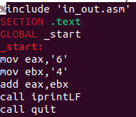

---
## Front matter
title: "Отчет по лабораторной работе №6"
subtitle: "Архитектура компьютера"
author: "Дмитрий Константинович Кобзев"

## Generic otions
lang: ru-RU
toc-title: "Содержание"

## Bibliography
bibliography: bib/cite.bib
csl: pandoc/csl/gost-r-7-0-5-2008-numeric.csl

## Pdf output format
toc: true # Table of contents
toc-depth: 2
lof: true # List of figures
lot: true # List of tables
fontsize: 12pt
linestretch: 1.5
papersize: a4
documentclass: scrreprt
## I18n polyglossia
polyglossia-lang:
  name: russian
  options:
	- spelling=modern
	- babelshorthands=true
polyglossia-otherlangs:
  name: english
## I18n babel
babel-lang: russian
babel-otherlangs: english
## Fonts
mainfont: PT Serif
romanfont: PT Serif
sansfont: PT Sans
monofont: PT Mono
mainfontoptions: Ligatures=TeX
romanfontoptions: Ligatures=TeX
sansfontoptions: Ligatures=TeX,Scale=MatchLowercase
monofontoptions: Scale=MatchLowercase,Scale=0.9
## Biblatex
biblatex: true
biblio-style: "gost-numeric"
biblatexoptions:
  - parentracker=true
  - backend=biber
  - hyperref=auto
  - language=auto
  - autolang=other*
  - citestyle=gost-numeric
## Pandoc-crossref LaTeX customization
figureTitle: "Рис."
tableTitle: "Таблица"
listingTitle: "Листинг"
lofTitle: "Список иллюстраций"
lotTitle: "Список таблиц"
lolTitle: "Листинги"
## Misc options
indent: true
header-includes:
  - \usepackage{indentfirst}
  - \usepackage{float} # keep figures where there are in the text
  - \floatplacement{figure}{H} # keep figures where there are in the text
---

# Цель работы
Освоение арифметических инструкций языка ассемблера NASM.

# Задание
1. Написать программу вычисления выражения y = f(x). Программа должна выводить
выражение для вычисления, выводить запрос на ввод значения x, вычислять задан-
ное выражение в зависимости от введенного x, выводить результат вычислений. Вид
функции f(x) выбрать из таблицы 6.3 вариантов заданий в соответствии с номером
полученным при выполнении лабораторной работы. Создайте исполняемый файл и
проверьте его работу для значений x1 и x2 из 6.3

# Выполнение лабораторной работы                                             |
[@gnu-doc:bash;@newham:2005:bash;@zarrelli:2017:bash;@robbins:2013:bash;@tannenbaum:arch-pc:ru;@tannenbaum:modern-os:ru]

Создаем каталог для программам лабораторной работы № 6, переходим в него и
создаем файл lab6-1.asm:.
{#fig:001 width=70%}

Вводим в файл lab6-1.asm текст программы из листинга 6.1  (рис. 1.2).
{#fig:002 width=70%}

Создаем исполняемый файл и запускаем его (рис. 1.3).
{#fig:003 width=70%}

Изменяем текст программы и вместо символов, записываем в регистры числа (рис. 1.4).
{#fig:004 width=70%}

Создаем исполняемый файл и запускаем его (рис. 1.5).
{#fig:005 width=70%}

Создаем файл lab6-2.asm в каталоге ~/work/arch-pc/lab06 и вводим в него текст программы из листинга 6.2 (рис. 1.6), (рис. 1.7).
{#fig:006 width=70%}
{#fig:007 width=70%}

Создаем исполняемый файл и запускаем его (рис. 1.8).
{#fig:008 width=70%}

Аналогично предыдущему примеру изменяем символы на числа. (рис. 1.9).
{#fig:009 width=70%}

Создаем исполняемый файл и запускаем его (рис. 1.10).
{#fig:010 width=70%}

Заменяем функцию iprintLF на iprint. Создаем исполняемый файл и запускаем его (рис. 1.11).
{#fig:011 width=70%}
{#fig:012 width=70%}

Создаем файл lab6-3.asm в каталоге ~/work/arch-pc/lab06 (рис. 1.13).
{#fig:013 width=70%}

Внимательно изучаем текст программы из листинга 6.3 и вводим в lab6-3.asm (рис. 1.14).
{#fig:014 width=70%}

Создаем исполняемый файл и запускаем его (рис. 1.15).
{#fig:015 width=70%}

Изменяем текст программы для вычисления выражения f(x) = (4 * 6 + 2)/5. Создаем исполняемый файл и проверяем его работу (рис. 1.16), (рис. 1.17).
{#fig:016 width=70%}
{#fig:017 width=70%}

Создаем файл variant.asm в каталоге ~/work/arch-pc/lab06 (рис. 1.18).
{#fig:018 width=70%}

Внимательно изучаем текст программы из листинга 6.4 и вводим в variant.asm (рис. 1.19).
{#fig:019 width=70%}

Создаем исполняемый файл и запускаем его (рис. 1.20).
{#fig:020 width=70%}

Ответы на вопросы:
1. mov eax, rem
call sprint
2. Используются для чтения строки ввода.
3. Инструкция call atoi используется для преобразования строки в число.
4. mov eax, x
call atoi
mov ebx, 20
div ebx
inc edx
5. Остаток от деления при выполнении инструкции div ebx записывается в регистр edx.
6. Инструкция inc edx используется для увеличения результата деления на 20 на 1.
7. mov eax, edx
call iprintLF

# Самостоятельная работа
Задание 1.
Пишем программу вычисления выражения y = f(x). Программа выводит
выражение для вычисления, выводить запрос на ввод значения x, вычисляет задан-
ное выражение в зависимости от введенного x, выводит результат вычислений. Вид
функции f(x) = 18(x+1)/6. Создаем исполняемый файл и
проверьте его работу для значений 3 и 1 (рис. 2.1).
{#fig:021 width=70%}
{#fig:022 width=70%}

# Выводы
В ходе выполнения лабораторной работы мною были освоены арифметические инструкции языка ассемблера NASM.

# Список литературы{.unnumbered}
::: {#refs}
:::
