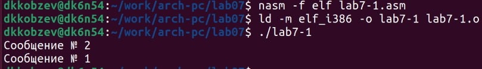

---
## Front matter
title: "Отчет по лабораторной работе №7"
subtitle: "Архитектура компьютера"
author: "Дмитрий Константинович Кобзев"

## Generic otions
lang: ru-RU
toc-title: "Содержание"

## Bibliography
bibliography: bib/cite.bib
csl: pandoc/csl/gost-r-7-0-5-2008-numeric.csl

## Pdf output format
toc: true # Table of contents
toc-depth: 2
lof: true # List of figures
lot: true # List of tables
fontsize: 12pt
linestretch: 1.5
papersize: a4
documentclass: scrreprt
## I18n polyglossia
polyglossia-lang:
  name: russian
  options:
	- spelling=modern
	- babelshorthands=true
polyglossia-otherlangs:
  name: english
## I18n babel
babel-lang: russian
babel-otherlangs: english
## Fonts
mainfont: PT Serif
romanfont: PT Serif
sansfont: PT Sans
monofont: PT Mono
mainfontoptions: Ligatures=TeX
romanfontoptions: Ligatures=TeX
sansfontoptions: Ligatures=TeX,Scale=MatchLowercase
monofontoptions: Scale=MatchLowercase,Scale=0.9
## Biblatex
biblatex: true
biblio-style: "gost-numeric"
biblatexoptions:
  - parentracker=true
  - backend=biber
  - hyperref=auto
  - language=auto
  - autolang=other*
  - citestyle=gost-numeric
## Pandoc-crossref LaTeX customization
figureTitle: "Рис."
tableTitle: "Таблица"
listingTitle: "Листинг"
lofTitle: "Список иллюстраций"
lotTitle: "Список таблиц"
lolTitle: "Листинги"
## Misc options
indent: true
header-includes:
  - \usepackage{indentfirst}
  - \usepackage{float} # keep figures where there are in the text
  - \floatplacement{figure}{H} # keep figures where there are in the text
---

# Цель работы
Изучение команд условного и безусловного переходов. Приобретение навыков написания программ с использованием переходов. Знакомство с назначением и структурой файла листинга.

# Задание
1. Напишите программу нахождения наименьшей из 3 целочисленных переменных a,b и . Значения переменных выбрать из табл. 7.5 в соответствии с вариантом, полученным при выполнении лабораторной работы № 7. Создайте исполняемый файл и проверьте его работу.
2. Напишите программу, которая для введенных с клавиатуры значений x и a вычисляет значение заданной функции f(x) и выводит результат вычислений. Вид функции f(x) выбрать из таблицы 7.6 вариантов заданий в соответствии с вариантом, полученным при выполнении лабораторной работы № 7. Создайте исполняемый файл и проверьте его работу для значений x и a из 7.6.

# Выполнение лабораторной работы                                             |
[@gnu-doc:bash;@newham:2005:bash;@zarrelli:2017:bash;@robbins:2013:bash;@tannenbaum:arch-pc:ru;@tannenbaum:modern-os:ru]

Создаем каталог для программ лабораторной работы № 7, переходим в него и создаем файл lab7-1.asm (рис. 1.1).
{#fig:001 width=70%}

Вводим в файл lab7-1.asm текст программы листинга 7.1 (рис. 1.2).
{#fig:002 width=70%}

Создаем исполняемый файл и запускаем его (рис. 1.3).
{#fig:003 width=70%}

Изменяем текст программы в соответствии с листингом 7.2 (рис. 1.4).
{#fig:004 width=70%}

Создаем исполняемый файл и запускаем его (рис. 1.5).
{#fig:005 width=70%}

Изменяем текст программы добавив или изменив инструкции jmp (рис. 1.6), (рис. 1.7).
{#fig:006 width=70%}
{#fig:007 width=70%}

Создаем файл lab7-2.asm в каталоге ~/work/arch-pc/lab07. Внимательно изучаем текст программы из листинга 7.3 и вводим в lab7-2.asm. (рис. 1.8), (рис. 1.9).
{#fig:008 width=70%}
{#fig:009 width=70%}

Создаем исполняемый файл и проверяем его работу (рис. 1.10).
{#fig:010 width=70%}

Создаем файл листинга для программы из файла lab7-2.asm (рис. 1.11).
{#fig:011 width=70%}

Открываем файл листинга lab7-2.lst с помощью mcedit (рис. 1.12).
{#fig:012 width=70%}

# Самостоятельная работа
Задание 1.
Пишем программу нахождения наименьшей из 3 целочисленных переменных a,b и . Значения переменных выбираем из табл. 7.5 в соответствии с вариантом, полученным при выполнении лабораторной работы № 7. Создаем исполняемый файл и проверяем его работу (рис. 2.1), (рис. 2.2).
{#fig:013 width=70%}
{#fig:014 width=70%}

Задание 2.
Пишем программу, которая для введенных с клавиатуры значений x и a вычисляет значение заданной функции f(x) и выводит результат вычислений. Вид функции f(x) выбираем из таблицы 7.6 вариантов заданий в соответствии с вариантом, полученным при выполнении лабораторной работы № 7. Создаем исполняемый файл и проверяем его работу для значений x и a из 7.6 (рис. 2.3), (рис. 2.4).
{#fig:015 width=70%}
{#fig:016 width=70%}

# Выводы
В ходе выполнения лабораторной работы мною были изучены команд условного и безусловного переходов. Приобретены навыки написания программ с использованием переходов. Также я познакомился с назначением и структурой файла листинга.

# Список литературы{.unnumbered}
::: {#refs}
:::
