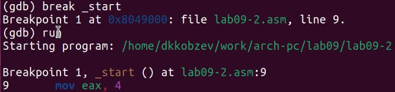

---
## Front matter
title: "Отчет по лабораторной работе №9"
subtitle: "Архитектура компьютера"
author: "Дмитрий Константинович Кобзев"

## Generic otions
lang: ru-RU
toc-title: "Содержание"

## Bibliography
bibliography: bib/cite.bib
csl: pandoc/csl/gost-r-7-0-5-2008-numeric.csl

## Pdf output format
toc: true # Table of contents
toc-depth: 2
lof: true # List of figures
lot: true # List of tables
fontsize: 12pt
linestretch: 1.5
papersize: a4
documentclass: scrreprt
## I18n polyglossia
polyglossia-lang:
  name: russian
  options:
	- spelling=modern
	- babelshorthands=true
polyglossia-otherlangs:
  name: english
## I18n babel
babel-lang: russian
babel-otherlangs: english
## Fonts
mainfont: PT Serif
romanfont: PT Serif
sansfont: PT Sans
monofont: PT Mono
mainfontoptions: Ligatures=TeX
romanfontoptions: Ligatures=TeX
sansfontoptions: Ligatures=TeX,Scale=MatchLowercase
monofontoptions: Scale=MatchLowercase,Scale=0.9
## Biblatex
biblatex: true
biblio-style: "gost-numeric"
biblatexoptions:
  - parentracker=true
  - backend=biber
  - hyperref=auto
  - language=auto
  - autolang=other*
  - citestyle=gost-numeric
## Pandoc-crossref LaTeX customization
figureTitle: "Рис."
tableTitle: "Таблица"
listingTitle: "Листинг"
lofTitle: "Список иллюстраций"
lotTitle: "Список таблиц"
lolTitle: "Листинги"
## Misc options
indent: true
header-includes:
  - \usepackage{indentfirst}
  - \usepackage{float} # keep figures where there are in the text
  - \floatplacement{figure}{H} # keep figures where there are in the text
---

# Цель работы
Приобретение навыков написания программ с использованием подпрограмм. Знакомство с методами отладки при помощи GDB и его основными возможностями.

# Задание
1. Преобразуйте программу из лабораторной работы №8 (Задание №1 для самостоятельной работы), реализовав вычисление значения функции f(x) как подпрограмму.
2. В листинге 9.3 приведена программа вычисления выражения (3 + 2) * 4 + 5. При запуске данная программа дает неверный результат. Проверьте это. С помощью отладчика GDB, анализируя изменения значений регистров, определите ошибку и исправьте ее.

# Выполнение лабораторной работы                                             |
[@gnu-doc:bash;@newham:2005:bash;@zarrelli:2017:bash;@robbins:2013:bash;@tannenbaum:arch-pc:ru;@tannenbaum:modern-os:ru]

Создаем каталог для программ лабораторной работы № 9, переходим в него и создаем файл lab09-1.asm (рис. 1.1).
{#fig:001 width=70%}

Вводим в файл программу листинга 9.1, создаем исполняемый файл и проверяем его работу (рис. 1.2), (рис. 1.3).
{#fig:002 width=70%}
{#fig:003 width=70%}

Изменяем текст программы добавив подпрограмму _subcalcul в подпрограмму _calcul, для вычисления выражения f(g(x)), где x вводится с клавиатуры, f(x) = 2x + 7, g(x) = 3x − 1 (рис. 1.4).
{#fig:004 width=70%}

Создаем исполняемый файл и запускаем его (рис. 1.5).
{#fig:005 width=70%}

Создаем файл lab09-2.asm с текстом программы из Листинга 9.2. Получаем исполняемый файл. Загружаем исполняемый файл в отладчик gdb. Проверяем работу программы, запустив ее в оболочке GDB с помощью команды run (рис. 1.6), (рис. 1.7).
{#fig:006 width=70%}
{#fig:007 width=70%}

Установливаем брейкпоинт на метку _start, и запускаем её (рис. 1.8).
{#fig:008 width=70%}

Посмотрим дисассимилированный код программы с помощью команды disassemble
начиная с метки _start (рис. 1.9).
{#fig:009 width=70%}

Переключитесь на отображение команд с Intel’овским синтаксисом, введя команду set disassembly-flavor intel (рис. 1.10).
{#fig:010 width=70%}

Pазличия отображения синтаксиса машинных команд в режимах ATT и Intel:
противоположное расположение операнда-источника и операнда-приемника;
в ATT регистры пишутся после ‘%’, а непосредственные операнды после ‘$’, в
синтаксисе Intel операнды никак не помечаются.

Включаем режим псевдографики для более удобного анализа программы (рис. 1.11).
{#fig:011 width=70%}
{#fig:012 width=70%}

На предыдущих шагах была установлена точка останова по имени метки (_start). Проверяем это с помощью команды info breakpoints. Установливаем еще одну точку останова по адресу предпоследней инструкции. Смотрим информацию о всех установленных точках останова (рис. 1.13), (рис. 1.14).
{#fig:013 width=70%}
{#fig:014 width=70%}

Выполняем 5 инструкций с помощью команды stepi и проследим за изменением
значений регистров. В результате изменяются значения регистров eax, ebx, ecx, edx (рис. 1.15).
{#fig:015 width=70%}

Смторим значение переменной msg1 по имени (рис. 1.16).
{#fig:016 width=70%}

Изменяем первый символ переменной msg1 (рис. 1.17).
{#fig:017 width=70%}

Заменяем любой символ во второй переменной msg2 (рис. 1.18).
{#fig:018 width=70%}

Выводим в различных форматах (в шестнадцатеричном формате, в двоичном формате и
в символьном виде) значение регистра edx (рис. 1.19).
{#fig:019 width=70%}

С помощью команды set изменяем значение регистра ebx (рис. 1.20).
{#fig:020 width=70%}

Использовав команду set изменили значение регистра ebx сначала на символ ‘2’, а затем на число 2, и сравнили вывод значения регистра в десятичном формате. В результате присвоения регистра значение символа ‘2’, выводится число 50, что соответствует символу в ‘2’ в таблице ASCII

Копируем файл lab8-2.asm, созданный при выполнении лабораторной работы №8, с программой выводящей на экран аргументы командной строки (Листинг 8.2) в файл с именем lab09-3.asm (рис. 1.21).
{#fig:021 width=70%}

Создаем исполняемый файл (рис. 1.22).
{#fig:022 width=70%}

Загружаем исполняемый файл в отладчик, указав аргументы (рис. 1.23).
{#fig:023 width=70%}

Установливаем точку останова перед первой инструкцией в программе и запускаем
ее (рис. 1.24).
{#fig:024 width=70%}

Адрес вершины стека храниться в регистре esp и по этому адресу располагается число равное количеству аргументов командной строки (включая имя программы (рис. 1.25).
{#fig:025 width=70%}

Смотрим остальные позиции стека (рис. 1.26).
{#fig:026 width=70%}

В первом хранится адрес, в остальных хранятся элементы. Элементы располо-
жены с интервалом в 4 единицы, так как стек может хранить до 4 байт:каждый
элемент стека занимает 4 байта, поэтому для получения следующего элемента
стека мы добавляем 4 к адресу вершины.

# Самостоятельная работа
Задание 1.
Преобразовываем программу из лабораторной работы №8 (Задание №1 для самостоятельной работы), реализовав вычисление значения функции f(x) как подпрограмму (рис. 2.1), (рис. 2.2), (рис. 2.3).
{#fig:027 width=70%}
{#fig:028 width=70%}
{#fig:029 width=70%}

Задание 2.
В листинге 9.3 приведена программа вычисления выражения (3 + 2) * 4 + 5. При запуске данная программа дает неверный результат. Проверяем это. С помощью отладчика GDB, анализируя изменения значений регистров, определяем ошибку и исправляем ее (рис. 2.4), (рис. 2.5), (рис. 2.6).
{#fig:030 width=70%}
{#fig:031 width=70%}
{#fig:032 width=70%}

# Выводы
В ходе выполнения лабораторной работы мною были приобретены навыки написания программ с использованием подпрограмм. Также я познакомился с методами отладки при помощи GDB и его основными возможностями.

# Список литературы{.unnumbered}
::: {#refs}
:::
