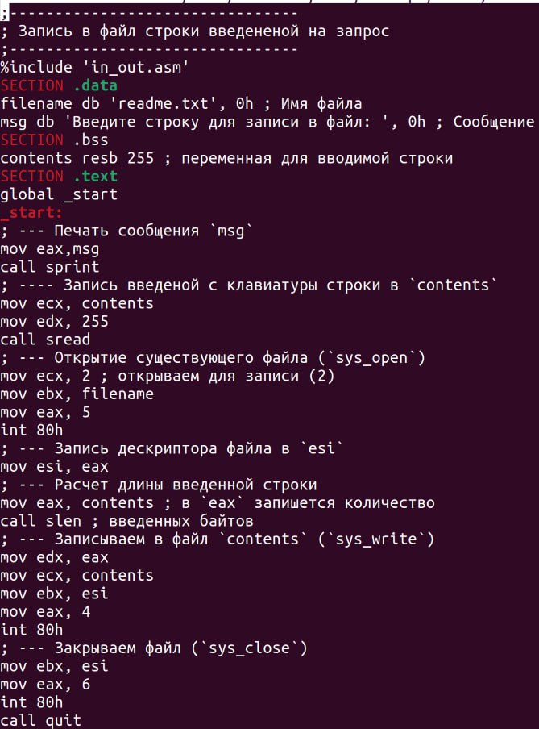
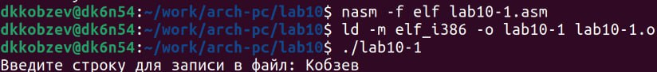
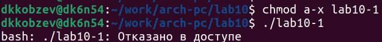
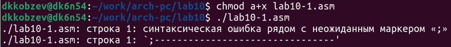
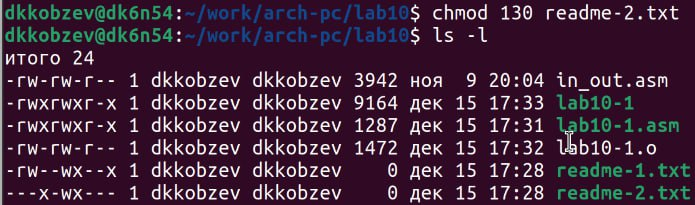
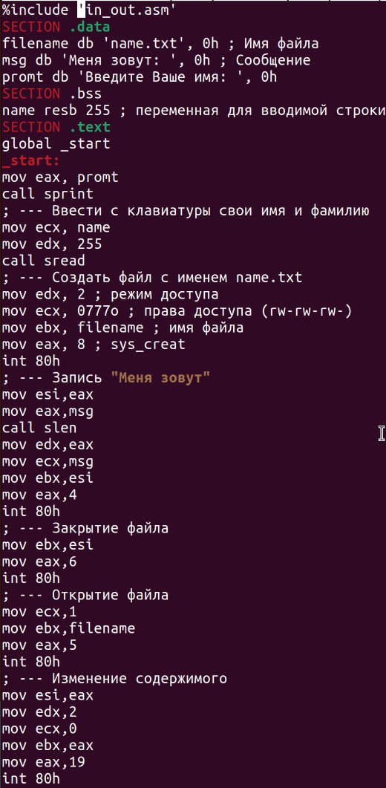
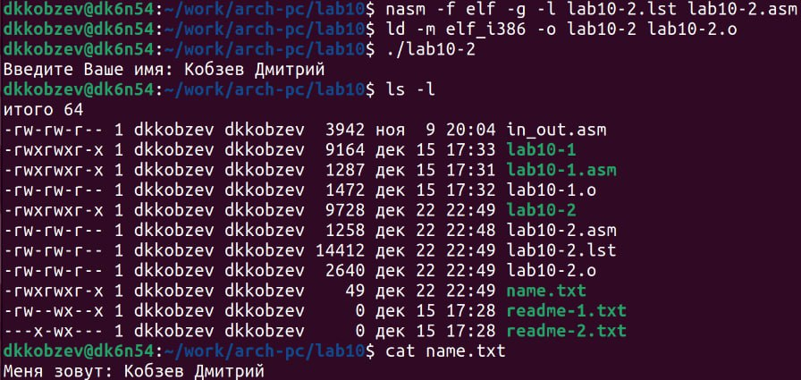

---
## Front matter
title: "Отчет по лабораторной работе №10"
subtitle: "Архитектура компьютера"
author: "Дмитрий Константинович Кобзев"

## Generic otions
lang: ru-RU
toc-title: "Содержание"

## Bibliography
bibliography: bib/cite.bib
csl: pandoc/csl/gost-r-7-0-5-2008-numeric.csl

## Pdf output format
toc: true # Table of contents
toc-depth: 2
lof: true # List of figures
lot: true # List of tables
fontsize: 12pt
linestretch: 1.5
papersize: a4
documentclass: scrreprt
## I18n polyglossia
polyglossia-lang:
  name: russian
  options:
	- spelling=modern
	- babelshorthands=true
polyglossia-otherlangs:
  name: english
## I18n babel
babel-lang: russian
babel-otherlangs: english
## Fonts
mainfont: PT Serif
romanfont: PT Serif
sansfont: PT Sans
monofont: PT Mono
mainfontoptions: Ligatures=TeX
romanfontoptions: Ligatures=TeX
sansfontoptions: Ligatures=TeX,Scale=MatchLowercase
monofontoptions: Scale=MatchLowercase,Scale=0.9
## Biblatex
biblatex: true
biblio-style: "gost-numeric"
biblatexoptions:
  - parentracker=true
  - backend=biber
  - hyperref=auto
  - language=auto
  - autolang=other*
  - citestyle=gost-numeric
## Pandoc-crossref LaTeX customization
figureTitle: "Рис."
tableTitle: "Таблица"
listingTitle: "Листинг"
lofTitle: "Список иллюстраций"
lotTitle: "Список таблиц"
lolTitle: "Листинги"
## Misc options
indent: true
header-includes:
  - \usepackage{indentfirst}
  - \usepackage{float} # keep figures where there are in the text
  - \floatplacement{figure}{H} # keep figures where there are in the text
---

# Цель работы
Приобретение навыков написания программ для работы с файлами.

# Задание
1. Напишите программу работающую по следующему алгоритму:
• Вывод приглашения “Как Вас зовут?”
• ввести с клавиатуры свои фамилию и имя
• создать файл с именем name.txt
• записать в файл сообщение “Меня зовут”
• дописать в файл строку введенную с клавиатуры
• закрыть файл

# Выполнение лабораторной работы                                             |
[@gnu-doc:bash;@newham:2005:bash;@zarrelli:2017:bash;@robbins:2013:bash;@tannenbaum:arch-pc:ru;@tannenbaum:modern-os:ru]

Создаем каталог для программам лабораторной работы № 10, переходим в него и
создаем файлы lab10-1.asm, readme-1.txt и readme-2.txt (рис. 1.1).
![Рис. 1.1: Создание файлов lab10-1.asm, readme-1.txt и readme-2.txt. (image/1.1.jpg){#fig:001 width=70%}

Вводим в файл lab10-1.asm текст программы из листинга 9.1, создаем исполняемый файл и проверяем его работу (рис. 1.2), (рис. 1.3).
{#fig:002 width=70%}
{#fig:003 width=70%}

С помощью команды chmod изменяем права доступа к исполняемому файлу lab10-1,
запретив его выполнение. Пытаемся выполнить файл(рис. 1.4).
{#fig:004 width=70%}

С помощью команды chmod изменяем права доступа к файлу lab10-1.asm с исходным текстом программы, добавив права на исполнение. Пытаемся выполнить его (рис. 1.5).
{#fig:005 width=70%}

В соответствии с вариантом в таблице 10.4 предоставляем права доступа к файлу readme-1.txt представленные в символьном виде, а для файла readme-2.txt – в двочном виде. Проверяем правильность выполнения с помощью команды ls -l. (рис. 1.6), (рис. 1.7).
{#fig:006 width=70%}
{#fig:007 width=70%}

# Самостоятельная работа
Задание 1.
Пишем программу работающую по следующему алгоритму:
• Вывод приглашения “Как Вас зовут?”
• ввести с клавиатуры свои фамилию и имя
• создать файл с именем name.txt
• записать в файл сообщение “Меня зовут”
• дописать в файл строку введенную с клавиатуры
• закрыть файл (рис. 2.1), (рис. 2.2), (рис. 2.3).
{#fig:008 width=70%}
{#fig:009 width=70%}
{#fig:010 width=70%}

# Выводы
В ходе выполнения лабораторной работы мною были приобретены навыки написания программ для работы с файлами.

# Список литературы{.unnumbered}
::: {#refs}
:::
